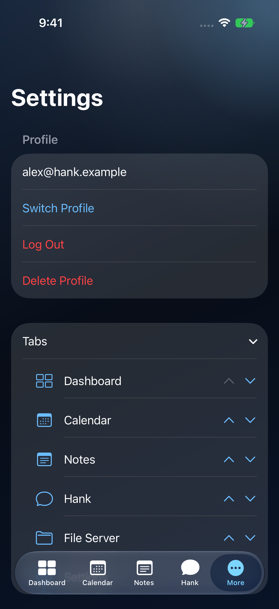
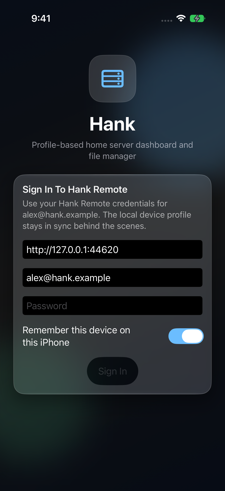
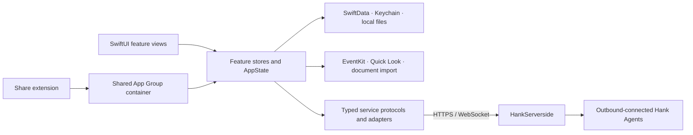

<div align="center">
  
  <h1>Hank for iOS</h1>
  <p>A native iPhone and iPad client for the self-hosted Hank platform.</p>
  <p>
    
    
    
  </p>
</div>

Hank brings notes, Kanban, calendars, file browsing, home controls, and an
assistant into a native SwiftUI workspace. SwiftData persists local profile
and configuration state; Keychain stores sensitive profile material.

**[HankServerside](https://github.com/AaronCampbellit/HankServerside-public) is the
canonical backend.** This repository owns the iOS interface and share extension.
It consumes the platform's HTTPS and WebSocket contracts rather than defining
a separate server.

| Profile and workspace preferences | Native sign-in |
| --- | --- |
|  |  |

Real iPhone simulator captures using a disposable synthetic account.
[Screenshot provenance and validation limits](docs/screenshots/README.md).
See the [platform gallery](https://github.com/AaronCampbellit/HankServerside-public#see-it-in-action)
for the web Notes and Kanban workspace.

## Implemented workspace

| Surface | What is implemented |
| --- | --- |
| Dashboard | Home context, shortcuts, Home Assistant entity states and controls |
| Notes | Notebooks, rich text, tags, attachments, sharing, revisions, and Kanban |
| Calendar | Device calendars through EventKit, calendar sources, and event workflows |
| File Server | Agent-backed file sources, app-local files, transfers, and native previews |
| Hank assistant | Conversations, staged attachments, tool-driven navigation, and server-configured providers |
| Settings | Local profiles, remote Home setup, preferences, account and connection workflows |
| Share extension | Import shared text, links, and files through the app's shared container |

Availability depends on your account permissions, server version, connected
agents, and provider configuration. Native notifications are currently disabled
in the app; the checked-in entitlements do not enable APNs. An assistant needs a
configured provider, and remote file/home actions need the corresponding agent.

## Build and run

You need **macOS with Xcode and an iOS 26 or newer SDK/runtime**. The app and
extension deployment targets are iOS 26; the project uses Swift 6 and supports
iPhone and iPad.

Clone the public source and enter its checkout:

```bash
git clone https://github.com/AaronCampbellit/Hank-public.git
cd Hank-public
```

1. Open `Hank.xcodeproj` and select the **Hank** scheme.
2. Choose an installed iPhone/iPad simulator and build or run.
3. For a device build, select your development team for both the app and share
   extension, and configure the matching App Group entitlement.
4. Sign in to your own disposable Hank server, or start the
   [HankServerside local demo](https://github.com/AaronCampbellit/HankServerside-public#try-the-local-demo).

For command-line verification, select an available simulator from
`xcrun simctl list devices available`, then:

```bash
xcodebuild -project Hank.xcodeproj -scheme Hank \
  -destination 'platform=iOS Simulator,name=iPhone 17 Pro' \
  CODE_SIGN_IDENTITY=- CODE_SIGNING_REQUIRED=NO build

xcodebuild -project Hank.xcodeproj -scheme Hank \
  -destination 'platform=iOS Simulator,name=iPhone 17 Pro' \
  CODE_SIGN_IDENTITY=- CODE_SIGNING_REQUIRED=NO test
```

Replace the example destination with a simulator installed on your Mac. The
local ad hoc simulator signature lets Keychain-backed sign-in run; disabling
signing can produce Keychain error `-34018`. Simulator builds do not prove
physical-device signing, App Group provisioning,
APNs delivery, or App Store distribution.

The Debug build has an existing synthetic-demo autoconnect hook:
`HANK_DEMO_AUTOCONNECT=1`, `HANK_DEMO_CLOUD_URL`, `HANK_DEMO_EMAIL`, and
`HANK_DEMO_PASSWORD`. Set these in a private local scheme or simulator launch
environment only. Keep generated credentials and personal schemes untracked.

## Architecture



| Path | Responsibility |
| --- | --- |
| `Hank/App` | App lifecycle, dependency composition, session state, and persistence bootstrap |
| `Hank/Core/Models` | SwiftData models and shared app data |
| `Hank/Core/Services` | Auth, Keychain, remote API/socket adapters, notes, notifications, and local file handling |
| `Hank/Features` | Dashboard, Calendar, Notes, File Server, assistant, and Settings views/stores |
| `HankShareExtension` | System share-sheet import entry point |
| `HankTests` | Auth, persistence recovery, notes, calendar, entity, and file-preview logic tests |
| `Vendor/TailscaleKit` | Optional source-only networking rebuild instructions; the current app does not use the framework |

Feature stores keep asynchronous loading and coordination separate from the
views. The server performs Home, user, role, and capability authorization;
client-side visibility alone is not an authorization boundary. Local notes and
profile recovery follow their own persistence and synchronization paths.

## Server compatibility and project status

Use the canonical [server API documentation](https://github.com/AaronCampbellit/HankServerside-public/blob/main/docs/api.md)
when changing a shared contract. [SERVER_SYNC.md](SERVER_SYNC.md) records
cross-repository rollout notes; its historical entries may retain retired
configuration names. The current server deployment documentation owns current
environment identifiers.

The current Xcode project does not use TailscaleKit, and this source tree contains
no vendored networking framework binaries. Optional [rebuild instructions](Vendor/TailscaleKit/UPSTREAM.md)
remain for future development; generated frameworks are ignored by Git and require
fresh dependency, provenance, and license review before distribution. The legacy
`TailscaleSettings` model remains in the SwiftData schema so older local stores
can still deserialize. See [third-party notices](THIRD_PARTY_NOTICES.md).
This is a development project; building the app is separate from release,
physical-device acceptance, and public distribution.

## License

Aaron Campbell reserves all rights to the original material he owns; see [LICENSE](LICENSE). Third-party code, dependencies, and assets retain their own licenses and notices. See [third-party notices](THIRD_PARTY_NOTICES.md) for reviewed components and outstanding publication or distribution requirements.
